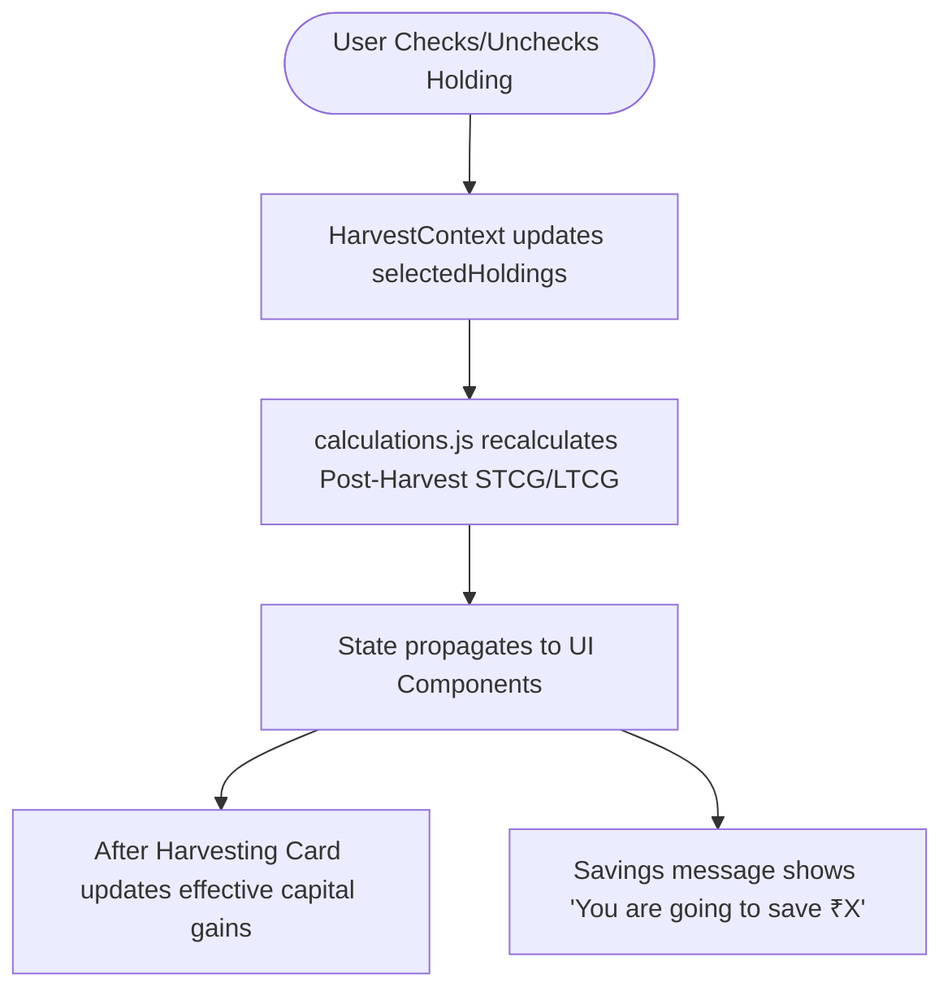

# KoinX Tax Loss Harvesting Tool

[](https://nextjs.org/)
[](https://reactjs.org/)
[](https://tailwindcss.com/)
[](https://vercel.com/)

A modern, highly-responsive **Tax Loss Harvesting** web application built for the KoinX Frontend Developer Internship Assignment. This dashboard simulates selling crypto assets currently trading at a loss to offset capital gains tax liabilities, showcasing real-time calculations, dark/light theme options, and custom interactive components.

🎯 **Live Demo**: [deployment-link](https://koin-x-tax-loss-harvesting-app-48wm.vercel.app/)

---

## 📸 Preview & Aesthetics


---

## ✨ Features

- 📊 **Real-time Live Calculations**: Instantly recalculates Short-Term and Long-Term Capital Gains, Nets, and effective tax liabilities upon asset selection.
- 💰 **Estimated Tax Savings**: Automatically prompts a green banner showing *"You are going to save ₹X"* based on the reduction in realized gains.
- 🌓 **Aesthetic Theme Toggle**: Supports native Tailwind CSS Dark Mode (dark navy background `#0B0E11` and card bg `#0F1923`) and Light Mode (slate white) with smooth background transitions.
- 💵 **Dual Currency Support**: Instantly switches between Indian Rupees (₹) and US Dollars ($) with locale-specific formatting.
- 📜 **Collapsible Disclaimers**: Sleek info banner summarizing tax rules, futures rules, and CoinGecko data sources.
- 🔍 **Interactive Table Sorting**: Multi-column sorting supporting asset names, prices, values, and gains (defaulting to absolute gain descending).
- 📂 **Optimized View All Row Toggle**: Limits table rows to 5 by default, expanding to 25 items on-click with smooth accordion effects.
- 📱 **Fully Mobile Responsive**: Tailored grid designs optimized for phones, tablets, and desktops.

---

## 🔄 System Flow Diagram

The following diagram illustrates how user actions trigger state updates, calculation recalculations, and UI re-renders:



---

## 📂 Project Directory Structure

```text
.
├── app/
│   ├── fonts/               # Custom system fonts
│   ├── globals.css          # Scrollbar, animations, theme transition rules
│   ├── layout.jsx           # Root wrapper, fonts, and HarvestProvider
│   └── page.jsx             # Main dashboard page, skeleton loader, and guide modal
├── components/
│   ├── CapitalGainsCard.jsx # Summary grid for Pre & After harvesting states
│   ├── DisclaimerBanner.jsx # Collapsible notes and tax disclaimers
│   ├── HoldingRow.jsx       # Individual asset row rendering custom SVGs
│   ├── HoldingsTable.jsx    # Responsive asset table with headers sorting and select-all
│   └── Navbar.jsx           # Logo header, currency toggler, and theme switcher
├── context/
│   └── HarvestContext.jsx   # Global React Context API state manager
├── data/
│   ├── mockCapitalGains.js  # Simulates starting capital gains (800ms delay)
│   └── mockHoldings.js      # Simulates 25 cryptocurrency holdings (800ms delay)
├── hooks/
│   ├── useCapitalGains.js   # Wrapper hook for fetching starting gains
│   └── useHoldings.js       # Wrapper hook for managing holdings selection list
├── utils/
│   └── calculations.js      # Pure math functions for capital gains and currency formatting
├── PROGRESS.md              # Requirement compliance log
└── README.md                # Project documentation
```

---

## 🧮 Business Logic & Mathematical Example

### 1. Capital Gains Formula
*   **Net STCG (Short-Term)** = $STCG\ Profits - STCG\ Losses$
*   **Net LTCG (Long-Term)** = $LTCG\ Profits - LTCG\ Losses$
*   **Realised Capital Gains (Pre-Harvesting)** = $Net\ STCG + Net\ LTCG$

### 2. Live Loss Harvesting
When a user checks an asset, the system simulates "selling" it:
*   If asset `STCG Gain > 0`, it increases `STCG Profits`.
*   If asset `STCG Gain < 0` (a loss), it increases `STCG Losses` (as a positive number).
*   The same logic applies to `LTCG`.
*   **Tax Savings** = $(STCG\ Harvested\ Losses \times 30\%) + (LTCG\ Harvested\ Losses \times 20\%)$

### 3. Example Scenario

#### **Pre-Harvesting (Starting State)**:
*   **STCG**: Profits = $70,200.88$, Losses = $1,548.53$ $\rightarrow$ **Net STCG = 68,652.35**
*   **LTCG**: Profits = $5,020.00$, Losses = $3,050.00$ $\rightarrow$ **Net LTCG = 1,970.00**
*   **Realised Gains**: $68,652.35 + 1,970.00 = 70,622.35$

#### **Action: Selecting Solana (SOL)**:
*   SOL STCG Gain = $-820.00$ (Loss)
*   SOL LTCG Gain = $-450.00$ (Loss)

#### **After-Harvesting (Post State)**:
*   **STCG Losses** increases by $820.00$ $\rightarrow$ $1,548.53 + 820.00 = 2,368.53$
*   **Net STCG** reduces to $70,200.88 - 2,368.53 = 67,832.35$
*   **LTCG Losses** increases by $450.00$ $\rightarrow$ $3,050.00 + 450.00 = 3,500.00$
*   **Net LTCG** reduces to $5,020.00 - 3,500.00 = 1,520.00$
*   **Effective Capital Gains** drops to $67,832.35 + 1,520.00 = 69,352.35$ (Gains reduced by $1,270.00$)
*   **Tax Savings** = $(820 \times 0.30) + (450 \times 0.20) = 246.00 + 90.00 =$ **₹336.00 Saved!**

---

## 🛠️ Getting Started

### Prerequisites
Make sure you have **Node.js** (v18+) and **npm** installed.

### 1. Clone the repository
```bash
git clone https://github.com/neeraj-ch7/KoinX-Tax-Loss-Harvesting-App.git
cd KoinX-Tax-Loss-Harvesting-App
```

### 2. Install dependencies
```bash
npm install
```

### 3. Run the development server
```bash
npm run dev
```
Open [http://localhost:3000](http://localhost:3000) in your browser to view the application.

### 4. Build for production
```bash
npm run build
```

---

## 🌐 API Specifications (Mock)

Both APIs mimic real-world network requests using a Promise wrapper and `setTimeout` with an **800ms** latency delay:

-   **`getCapitalGains()`**: Returns starting capital gains:
    ```json
    {
      "capitalGains": {
        "stcg": { "profits": 70200.88, "losses": 1548.53 },
        "ltcg": { "profits": 5020.00, "losses": 3050.00 }
      }
    }
    ```
-   **`getHoldings()`**: Returns an array of 25 holdings (USDC, WETH, SOL, MATIC, USDT, etc.) with totals, average buy prices, current prices, and short/long term gains/balances.

---

## 📝 Assumptions Made

1.  **Tax Rates**: Assumed a standard **30%** Short-Term Capital Gains (STCG) tax rate and a **20%** Long-Term Capital Gains (LTCG) tax rate for calculating tax savings.
2.  **Sale Behavior**: Checking a row simulates selling the **entirety** of the user's holdings for that specific coin (`Amount to Sell = Total Holding`).
3.  **Vercel Deployment**: The app compiles statically to run out-of-the-box on Vercel without requiring complex server-side adapters.

---

## 👤 Author

-   **Neeraj Chauhan** - [GitHub](https://github.com/neeraj-ch7)
-   *Assignment submitted for KoinX Frontend Internship.*
